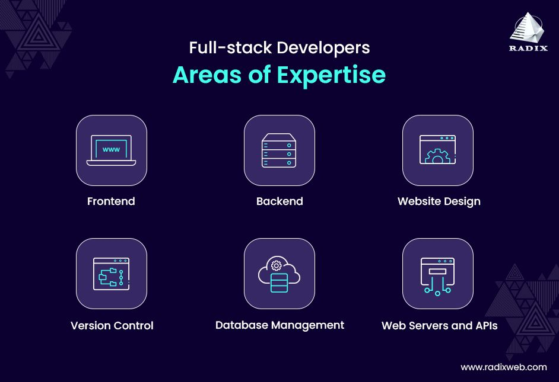
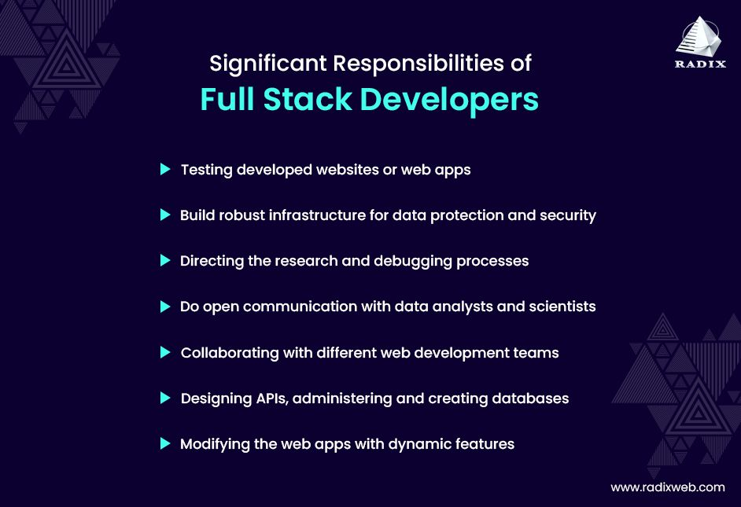

# Web Dev

Web development can loosely be divided into two areas: frontend and backend. Someone who works in both is considered a **full-stack developer**, or a software engineer that works across the full stack.

## Frontend
The **frontend** is everything you see and interact with on a website. Imagine you're visiting a cool website. The buttons you click, the images you see, the text you read, and the animations you enjoy are all part of the frontend. It’s like the cover and pages of a book, the part that the reader directly engages with. 

Frontend developers use languages like:

- **HTML (HyperText Markup Language)**: This is like the skeleton of a webpage. It structures the content, telling the browser where to place text, images, and other elements.
- **CSS (Cascading Style Sheets)**: This is like the clothing and makeup for the webpage. It styles the content, determining colors, fonts, layout, and overall look.
- **JavaScript**: This adds interactivity and dynamic features to the webpage, like making buttons clickable, creating animations, and loading new content without refreshing the page.

If you're interested in a frontend career, you can look at the [MDN Curriculum](https://developer.mozilla.org/en-US/curriculum/), which provides a structured way to plan your learning.

### How is JavaScript different from other languages, like Python?

JavaScript and Python are both programming languages, but they are designed for different purposes and environments.

JavaScript is primarily used for web development. It runs in web browsers and allows developers to create interactive and dynamic web pages. When you see animations, form validations, or dynamic content on a website, that's often powered by JavaScript. It excels at manipulating HTML and CSS to create engaging user experiences on the web.

Python is a general-purpose language that's known for its simplicity and readability. It's used in a wide range of applications, from web development to data analysis, artificial intelligence, and scientific computing. Python's straightforward syntax makes it easy to learn and write code quickly, making it a popular choice for beginners and experienced developers alike.

## Backend / Server-Side

The **backend** is everything that happens behind the scenes. Imagine you’re ordering a pizza online. You choose your toppings and place your order on the website (frontend), but the kitchen where the pizza is made and the process that gets the pizza to your door is the backend.

Backend developers use languages like:

- **Python, Ruby, PHP, Java, and Node.js**: These are programming languages used to create the server-side logic. They handle things like storing your data, processing your order, and making sure everything runs smoothly.
- **Databases (like MySQL, PostgreSQL, MongoDB)**: These are used to store all the data. When you create an account or save a file, the backend makes sure this information is saved in a database.

### Python

Python is known for its simplicity and ease of use. Its syntax is clear and readable, which helps developers write and understand code quickly. Python is an interpreted language, meaning the code is executed line-by-line, which makes it slower than compiled languages but great for rapid development and prototyping.

While JavaScript is tailored for web development, Python is versatile and user-friendly for many types of projects, and C offers fine-grained control and high performance for system-level programming.

### Server-Side JavaScript with Node.js

Up til now, you've learned about JavaScript being a frontend language. But did you know that you can also create a backend server using only JavaScript?

Because of the power of the [Node.js](https://www.youtube.com/watch?v=pU9Q6oiQNd0) [runtime](../../resources/glossary.md#r) (don't worry about the fancy term, it just means the environment and tools that your application needs to run properly), we are now able to run JavaScript server-side since 2011.

It has a much less mature ecosystem and some argue that using JavaScript for product-grade business logic is a bit scary, as it's less robust than purpose-built languages like Java. Still, it's very powerful for smaller, less computing-intensive projects.

Traditionally, languages like Python, Golang, and Java are used server-side to create backend with business logic.

## Full-Stack Development

### How They Work Together
Think of a popular social media site. When you log in and scroll through your feed, the frontend is displaying your friends' posts, photos, and videos in an attractive layout. When you like a post or add a comment, the frontend sends your action to the backend, which then updates the data in the database and ensures everything is saved correctly. The backend also fetches new posts and updates your feed accordingly.

In short:

- **Frontend**: What you see and interact with on the website.
- **Backend**: The behind-the-scenes processes that make the website work.

Both are essential for creating a fully functional and enjoyable website!

### Full-Stack Careers

Full-stack developers have fulfilling careers that allow them to become deeply familiar with an entire project as they work across all parts of the stack.

One of the downsides, however, is that it can be a very stressful role as there are more responsibilities, more things to learn, and more can go wrong. Similarly, you may never feel like you truly "master" any one particular area. Still, it allows for a flexible career.

To a certain extent, all developers have worked on something full-stack, but a _truly_ full stack dev who is employed as such is less common nowadays (of course, that can always change!).

